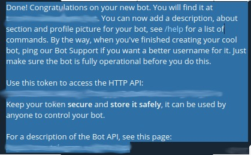
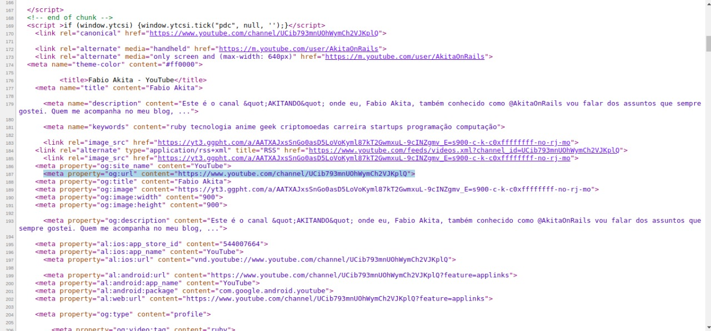
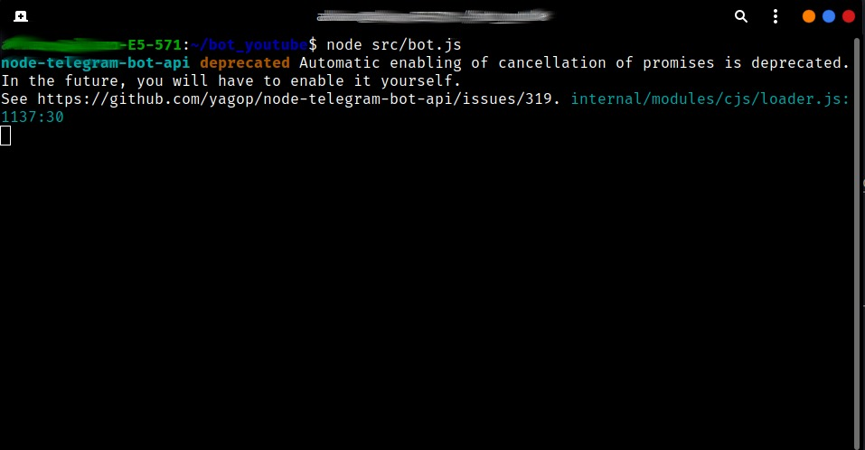

# TelYou_bot
A bot for use on the telegram, using the youtube API to promote the search and listing of the channels that most access via chatbot and automate daily use on youtube, without wasting time browsing from channel to channel.

# What is?

A bot used in Telegram to list videos from your favorite YouTube channels. Adding the channel ID (this part is in the code, in the src/channels.js file), and using a command, a search is made via Youtube Data API V3 and returns the last video or videos by sending them via chat.

# Configuration

### The first thing that must be done is to generate a Token for creating bot's on Telegram.

1º - To create a Token, you must first look for @Botfather in the top input. Once you find it, a conversation should be started by clicking on start and after that add the ```/newbot``` command.

2º - Once this is done, a name and username ending with the postfix bot must be entered.

3º - A message will appear like this:



4º - Having that, copy your Token and paste it in the ```./src/telegram.js``` file between the double quotes in line 2.

### That done, now you will need a token to make use of the youtube API. 

For this, see the documentation at [Youtube Data API V3](https://developers.google.com/youtube/v3/docs)

You will have to create a project and then activate the API in your google account. As soon as you do this and a few more steps, you will get your Token.

If you got your token, copy and paste it into ```./src/youtube.js``` on line 2, between the double quotes.

Note: __Tokens are of type string__

# Adding channels

To add channels, just add the channelsId of your favorite channels in the arrays that start with "channel" in the module code ```./src/channels.js```.They have a personal rating, but can be changed without any problems to the user's taste.

__Id channels can be obtained in two ways:__

The first can be done for channels that DO NOT have custom names in their URL, which is the simplest form.
Just go to the desired channel and copy everything that comes after https://www.youtube.com/channel/.

It will look something like __```UCe50QVVNmssbxsuddzSkxEg```__

The second is less simple. You will have to inspect the source code of the desired page (channel) and look for a __```meta```__ property called __```og:url```__.

__See the image below marked with lightblue__



So you can take everything you have after ```https://www.youtube.com/channel/``` and add it to the desired array. Much like the previous mode.

__Note: Remember that the content must be saved as a string.__

# Running

Finally, open the terminal in the folder where the files are located and enter the following command:

__```ǹode src/bot.js```__

See the image below the terminal:


